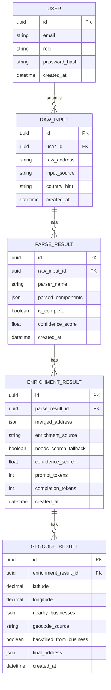

# Address Enrichment Pipeline

This repository is for a 4-step address enrichment pipeline.

The goal is to take a raw address string, progressively enrich it, and return the best structured result available:

1. Libpostal parse for fast local extraction.
2. LLM extraction to fill gaps in the structured result.
3. LLM web search to resolve any remaining missing fields.
4. Geocoding plus nearby-business lookup, with fallback behavior and regex backfill for incomplete addresses.

## Users

The primary users of this tool are:

- Data/ops users who need messy address strings normalized into structured records.
- Engineers who need a deterministic pipeline they can embed in larger workflows.
- Administrators who need to configure credentials, proxy settings, retries, and fallback behavior.

## Week 1 Goal

Week 1 is about defining the problem clearly before building anything:

- lock the input/output contract
- define what counts as a complete address
- document the step-by-step escalation rules
- document fallbacks, retries, confidence scoring, and cost estimation
- sketch the three main screens or views on paper before implementation

## User Stories

1. As a data/ops user, I want to paste a raw address string and get back structured fields like street, city, state, zip, and country.
2. As a data/ops user, I want the pipeline to stop early when libpostal already found all required fields, so I do not pay for unnecessary LLM calls.
3. As a data/ops user, I want missing fields to be filled by an LLM using the raw input plus the libpostal parse, so partial addresses can still become usable records.
4. As a data/ops user, I want the pipeline to escalate to search-enabled LLMs only when the earlier steps are still incomplete, so the system uses the cheapest reliable path first.
5. As a data/ops user, I want the geocoding step to return latitude, longitude, and nearby businesses, so I can validate and enrich the address context.
6. As a data/ops user, I want the system to backfill missing city, state, or zip data from the first nearby business address when possible, so downstream records are still as complete as possible.
7. As an engineer, I want retry logic and confidence scoring built into the plan, so transient failures and low-quality parses are handled consistently.
8. As an administrator, I want proxy and CA bundle handling documented, so the pipeline can run reliably in enterprise or AKS environments.

## Out of Scope (Week 1)

The following are intentionally out of scope for Week 1 implementation and will be revisited in later weeks based on AP_Plan milestones:

- adding authentication, user management, or role-based access control
- storing customer data beyond the pipeline inputs and outputs needed for testing
- optimizing model prompts beyond the initial extraction and search prompts
- production deployment, cloud infrastructure, or release automation
- large-scale batch processing, queue orchestration, or distributed workers
- advanced analytics, reporting dashboards, or observability platforms
- real customer address data before the pipeline is validated and secured

## Paper Sketches

1. Raw address input and pipeline output view.
2. Step-by-step enrichment trace showing libpostal, LLM extraction, search, and geocoding.
3. Settings and diagnostics view for retries, proxy settings, confidence score, and cost estimates.

## Data Model

The pipeline stores each processing stage explicitly so you can inspect what happened at every step.

### Entity relationship view



### Table responsibilities

- `user`: identity and access context for who ran a pipeline request.
- `raw_input`: the original address string and submission metadata.
- `parse_result`: libpostal output and completion status.
- `enrichment_result`: LLM-filled fields, source path, confidence, and token usage.
- `geocode_result`: coordinates, nearby businesses, fallback source, and final backfilled address.

### Relationship rules

- One `user` can submit many `raw_input` records.
- One `raw_input` can have many `parse_result` records (useful for retries or parser versioning).
- One `parse_result` can have many `enrichment_result` records (prompt iterations or fallback runs).
- One `enrichment_result` can have many `geocode_result` records (primary/fallback attempts).

### Why this structure

- Keeps each pipeline stage auditable and debuggable.
- Preserves provenance of where each field came from.
- Supports retries and side-by-side model or API comparisons.
- Makes confidence and cost analysis first-class from day one.

## Notes for Week 1

The first week should produce a clear spec, not code. If the pipeline contract is ambiguous, resolve the ambiguity here before implementation starts.

## Current Backend Milestone

The backend covers Days 6, 8, 9, and 10 — parsing through full LLM enrichment:

**Parse endpoints (Day 6 + 8)**
- `POST /parse` — write raw input + parse result, return full parse record.
- `GET /parse/{id}` — parse record with related enrichment/geocode rows.
- `GET /parse/{id}/summary` — LLM-generated (or rule-based) enrichment path summary.
- `GET /parses` — paginated parse list with filters (parser, completeness, confidence, downstream presence).
- `GET /inputs` — paginated raw-input list with per-input summary counts.

**Enrichment endpoint (Day 10)**
- `POST /enrich` — runs the full 4-step pipeline for a given `parse_result_id`:
  - Step 1: libpostal parse (stub, replaceable when libpostal is available).
  - Step 2: GPT-4o gap fill (stub when `OPENAI_API_KEY`/`OPENAI_API_BASE_URL` not set).
  - Step 3: `gpt-4o-search-preview` web search fallback (stub when not configured).
  - Step 4: geocode via `gpt-4o-search-preview` primary, Serper Maps API fallback (stub when not configured).
  - Computes confidence label (`low`/`medium`/`high`) and USD cost estimate.
  - Generates enrichment path summary and stores it with the enrichment record.

**Embeddings (Day 9)**
- `parse_result.embedding` column (vector(384), nullable) backed by pgvector.
- `POST /enrich` auto-generates and stores an embedding for the parse record.
- Backfill script: `python -m scripts.backfill_embeddings [--dry-run] [--force] [--batch-size N]`.
- Provider: `sentence-transformers/all-MiniLM-L6-v2` (local, no API key needed).
- Company API slot is wired and ready; set `EMBEDDINGS_PROVIDER=company_api` + credentials when available.

### Local run steps

From repository root:

1. `docker-compose up -d postgres`
2. `cd backend`
3. `..\.venv\Scripts\alembic.exe upgrade head`
4. `..\.venv\Scripts\uvicorn.exe app.main:app --reload`
5. Open Swagger UI: `http://127.0.0.1:8000/docs`

**First-run note:** the sentence-transformers model (`all-MiniLM-L6-v2`, ~90 MB) is downloaded from HuggingFace on first embedding call. Subsequent runs use the local cache.

### Environment variables

Copy `.env.example` to `.env` and fill in:

| Variable | Required for | Default |
|---|---|---|
| `DATABASE_URL` | All | local psycopg URL |
| `EMBEDDINGS_PROVIDER` | Day 9 embeddings | `local` |
| `EMBEDDINGS_MODEL` | Day 9 embeddings | `all-MiniLM-L6-v2` |
| `EMBEDDINGS_DIMENSION` | Day 9 embeddings | `384` |
| `OPENAI_API_BASE_URL` | Day 10 LLM steps | *(placeholder)* |
| `OPENAI_API_KEY` | Day 10 LLM steps | *(placeholder)* |
| `SERPER_API_KEY` | Day 10 geocode fallback | *(placeholder)* |
| `COST_INPUT_PER_1K_TOKENS` | Cost estimator | `0.005` |
| `COST_OUTPUT_PER_1K_TOKENS` | Cost estimator | `0.015` |

### Example: POST /parse request

```json
{
	"raw_address": "3400 W Plano Pkwy, Plano, TX 75075, USA",
	"input_source": "swagger",
	"country_hint": "US"
}
```

### Example: POST /parse response shape

```json
{
	"id": "uuid",
	"raw_input_id": "uuid",
	"parser_name": "stub",
	"parsed_components": {
		"street_line": "3400 W Plano Pkwy",
		"city": "Plano",
		"state": "TX",
		"postal_code": "75075",
		"country": "US"
	},
	"is_complete": true,
	"confidence_score": 0.75,
	"created_at": "timestamp",
	"raw_input": {
		"id": "uuid",
		"raw_address": "3400 W Plano Pkwy, Plano, TX 75075, USA",
		"input_source": "swagger",
		"country_hint": "US",
		"created_at": "timestamp"
	}
}
```

### Example: GET /parse/{id} response shape

```json
{
	"id": "uuid",
	"raw_input_id": "uuid",
	"parser_name": "stub",
	"parsed_components": {
		"street_line": "3400 W Plano Pkwy",
		"city": "Plano",
		"state": "TX",
		"postal_code": "75075",
		"country": "US"
	},
	"is_complete": true,
	"confidence_score": 0.75,
	"created_at": "timestamp",
	"raw_input": {
		"id": "uuid",
		"raw_address": "3400 W Plano Pkwy, Plano, TX 75075, USA",
		"input_source": "swagger",
		"country_hint": "US",
		"created_at": "timestamp"
	},
	"enrichment_results": [
		{
			"id": "uuid",
			"parse_result_id": "uuid",
			"provider_name": "llm-stub",
			"status": "complete",
			"enriched_components": {
				"street_line": "3400 W Plano Pkwy",
				"city": "Plano",
				"state": "TX",
				"postal_code": "75075"
			},
			"is_complete": true,
			"confidence_score": 0.82,
			"error_message": null,
			"created_at": "timestamp"
		}
	],
	"geocode_results": [
		{
			"id": "uuid",
			"parse_result_id": "uuid",
			"enrichment_result_id": "uuid",
			"provider_name": "geocoder-stub",
			"status": "matched",
			"latitude": 32.985,
			"longitude": -96.75,
			"result_payload": {
				"match_quality": "roof-top"
			},
			"error_message": null,
			"created_at": "timestamp"
		}
	]
}
```

### Example: GET /parses response shape

```json
{
	"items": [
		{
			"id": "uuid",
			"raw_input_id": "uuid",
			"parser_name": "stub",
			"is_complete": true,
			"confidence_score": 0.75,
			"created_at": "timestamp",
			"raw_address": "3400 W Plano Pkwy, Plano, TX 75075, USA",
			"input_source": "swagger",
			"country_hint": "US",
			"enrichment_result_count": 1,
			"geocode_result_count": 1,
			"latest_enrichment_status": "complete",
			"latest_geocode_status": "matched"
		}
	],
	"total": 1,
	"limit": 50,
	"offset": 0
}
```

### Example: GET /inputs response shape

```json
{
	"items": [
		{
			"id": "uuid",
			"raw_address": "1600 Amphitheatre Parkway, Mountain View, CA 94043, USA",
			"input_source": "swagger",
			"country_hint": "US",
			"created_at": "timestamp",
			"parse_result_count": 1,
			"enrichment_result_count": 1,
			"geocode_result_count": 1,
			"has_enrichment": true,
			"has_geocode": true
		}
	],
	"total": 1,
	"limit": 50,
	"offset": 0
}
```

### Query examples

1. `GET /parses?has_enrichment=true&has_geocode=true`
2. `GET /parses?is_complete=true&min_confidence=0.7`
3. `GET /inputs?input_source=swagger&has_enrichment=true`
4. `GET /inputs?country_hint=US&has_parse_results=true`

### Repository structure status

The repository now includes the target-structure scaffolding from the plan:

- backend runtime entrypoint at `backend/app/main.py`
- compatibility shim at `backend/main.py`
- service-layer package in `backend/app/services/`
- later-milestone router placeholders in `backend/app/api/routers/`
- LLM package scaffold in `backend/app/llm/`
- backend packaging/container scaffolds in `backend/pyproject.toml` and `backend/Dockerfile`
- frontend scaffold in `frontend/`
- CI scaffold in `.github/workflows/ci.yml`

These added files are scaffolds to match the planned layout; they do not imply later milestones are implemented yet.

### Verification checklist

1. Submit 5 fake addresses via `POST /parse`.
2. Save returned parse IDs and raw input IDs.
3. Fetch each parse via `GET /parse/{id}` and confirm `200` plus downstream arrays.
4. Call `GET /parses` with and without filters and confirm pagination and counts.
5. Call `GET /inputs` and verify inserted raw input IDs plus summary counts are present.
6. Submit a blank `raw_address` and verify validation returns `422`.
